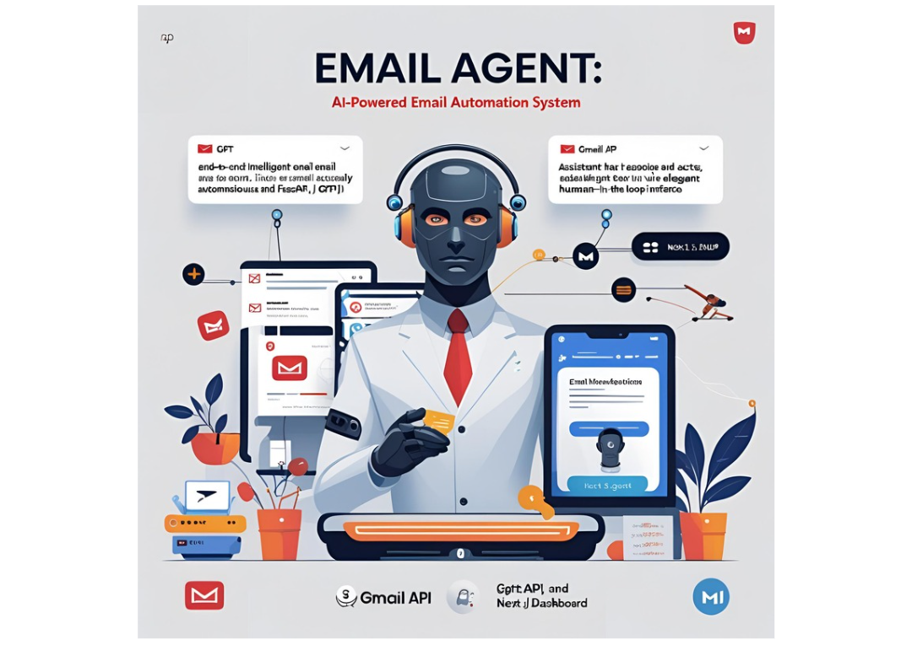

# Email Agent: AI-Powered Email Automation System

An end-to-end intelligent email assistant that reads, reasons, and acts on your inbox autonomously using GPT-4, Gmail API, FastAPI, and a Next.js dashboard, while keeping you in full control via an elegant human-in-the-loop interface.

---

## Features

- **LLM-based intent reasoning** using GPT-4 function calling
- Automated workflows:
  - Generate contextual replies
  - Summarize email content
  - Schedule meetings & reminders
  - Add tasks to a persistent to-do list
- **Gmail integration** (OAuth2): read, send, archive, modify
- **Thread-level memory & context management** (SQLite)
- **Human-in-the-loop UI**
  - React (Next.js) dashboard
  - View inbox, memory, draft suggestions
  - Edit & approve replies before sending
- Toggleable **auto-send / manual mode**
- Modular backend built in **FastAPI**
- Optional **Streamlit dashboard** for rapid experimentation

---

## Architecture

```
Gmail API <----> FastAPI backend <----> GPT-4 (Function Calls)
               |
SQLite Memory (threads, todos, meetings)
               │
Next.js Frontend  <---->  Human
````

---

## Getting Started

### 1. Clone the project

```bash
git clone <repo-url>
cd ai-email-agent
````

---

### 2. Backend Setup (Python)

```bash
python -m venv venv
source venv/bin/activate
pip install -r requirements.txt
```

Create `.env`:

```
OPENAI_API_KEY=sk-...
```

Place your Google OAuth client JSON as:

```
credentials.json
```

Run backend + Streamlit hybrid mode:

```bash
streamlit run run_app.py
```

OR run FastAPI standalone:

```bash
uvicorn api:app --reload
```

---

## Gmail OAuth Setup

* Go to [https://console.cloud.google.com](https://console.cloud.google.com)
* Create a project → Enable Gmail API
* Create OAuth 2.0 **Desktop** credentials → download JSON → save as `credentials.json`
* First run will open browser → grant Gmail permission
  Requires **gmail.modify** scope for sending/archiving

---

## Configuration

| Setting     | Location             | Description                  |
| ----------- | -------------------- | ---------------------------- |
| `AUTO_SEND` | `llm_agent.py`       | Whether to auto-send replies |
| GPT Model   | `.env` / `functions` | e.g. `gpt-4o-mini`, `gpt-4`  |
| DB Storage  | `assistant.db`       | Memory & Thread persistence  |

---

## How the Agent Works

1. Backend polls Gmail `/emails`
2. For each message, GPT-4 decides a function call:

   * `generate_reply`, `summarize_email`, `schedule_meeting`, `add_to_todo`
3. Backend executes mapped Python handler
4. GPT-generated summary of the thread stored in DB
5. Human approves edits/approves reply in UI (or AUTO\_SEND=true handles automatically)

---

## Future Roadmap

* Background scheduler (cron)
* Google Calendar integration
* Multi-user account + login
* Attachment & PDF extractors (resume, invoice, etc)
* Analytics dashboard – time saved, edit ratio, etc.

---

## Credits

Built by **Saral Sureka** as a self-initiated project using OpenAI API, FastAPI, Gmail API, SQLite, and Next.js.

---

## License

Will be updated. (It is suggested to give an acknowledgement if the framework is used to built projects.) 


## Video Demo (Proof of Completion)

[](https://drive.google.com/file/d/158Ro0FPOZiq4XN_SHpXmdqjO_9mr4YL-/view?usp=sharing)

## Major Update

* Enhanced Frontend 
* To-Do list enhanced
* Dynamic Inbox list
* Save scheduled Meeting on-the-go
* INtegration with GMail Calender

```bash
cd ai_email_agent_v2/
```
